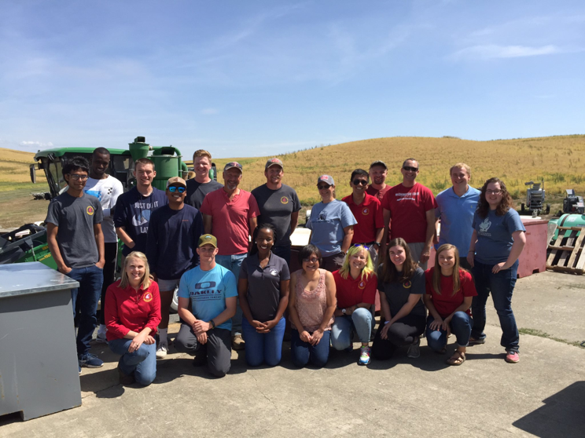

<p>&nbsp;</p>

<p>&nbsp;</p>

<!-- test inserting image-->

<center>

{#id .class width=300 height=300px}

</center>

<p>&nbsp;</p>

<center> <font size="6"> **Wrappers for Easy Association, Tools, and Selection for Breeders (WhEATBreeders)** </font> </center>

<p>&nbsp;</p>

<p>&nbsp;</p>

### **Table of contents**

#### Introduction

#### Description of package functions

#### Getting started

#### Load Package

#### Phenotypic Data

#### Genotypic Data

#### Genomic Selection Tutorial

#### Genome-Wide Association Tutorial using GAPIT

#### Cross Prediction

#### Frequently asked questions

#### Further Information

<p>&nbsp;</p>

<p>&nbsp;</p>

<p>&nbsp;</p>

### **Introduction**

WhEATBreeders was created to lower the bar for implementing genomic selection models for plant breeders to utilize within their own breeding programs. Not only does include functions for genotype quality control and filtering, but it includes easy to use wrappers for the most commonly use models in many scenarios with K-Fold cross-validation or validation sets. You can also implement GWAS assisted genomic selection. We created a full wrapper for quality control and genomci selection in our function "WHEAT". Additionaly we walk through the set up of unrpelicated data using adjuste means and calculate cullis heritability. We also go through multi-output and multi-trait wrappers for GWAS in GAPIt. Finally we walk through cross-prediction using PopVar, rrBLUP, and sommer.

### **Description of package functions**

For a full list of functions within WhEATBreeders see “Reference_Manual.pdf” this file contains not only the full list of functions but also a description of each. The pdf also has each functions arguments listed. And like with all R packages once WhEATBreeders is installed and loaded you can type ?function_name and that specific function’s full descriptions will appear in the help tab on RStudio.

### **Getting started**

First if you do not already have R and R studio installed on your computer head over to <https://www.r-project.org/> and install the version appropriate for you machine. Once R and R studio are installed you will need to install the WhEATBreeders package since this is a working package in it’s early stages of development it’s only available through Github. To download files off Github first download and load the library of the package “devtools” using the code below.

# Packages needed

```{r eval=FALSE}
if (!require("pacman")) install.packages("pacman")
pacman::p_load(devtools)
library(devtools)
#Better for FDR function
devtools::install_github("jiabowang/GAPIT3",force=TRUE)
library(GAPIT3)

if (!requireNamespace("BiocManager", quietly = TRUE))
    install.packages("BiocManager")

  BiocManager::install("impute")
#From the source
#require(compiler) #for cmpfun
#Only if you want the source code
#source("http://zzlab.net/GAPIT/GAPIT.library.R")
#source("http://zzlab.net/GAPIT/gapit_functions.txt") #make sure compiler is running
#source("http://zzlab.net/GAPIT/emma.txt")

if (!require("pacman")) install.packages("pacman")
pacman::p_load(BGLR,
  rrBLUP,
  caret,
  tidyr,
  dplyr,
  Hmisc,
  WeightIt,
  mpath,
  glmnetUtils,
  glmnet,
  MASS,
  Metrics,
  stringr,
  lsa,
  keras,
  tensorflow,
  BMTME,
  plyr,
  data.table,
  bigmemory,
  biganalytics,
  ggplot2,
  tidyverse,
  knitr,
  cvTools,
  vcfR,
  compiler,
  gdata,
  PopVar,
  BLR,
  sommer,
  heritability,
  arm,
  optimx,
  purrr,
  psych,
  lme4,
  lmerTest,
  gridExtra,
  grid,
  readxl,
  devtools)


```

### **Load Package**

Next using the code below download and install the package WhEATBreeders from Github. The bottom two line of code in the chunk below make sure the dependencies WhEATBreeders relies on are also downloaded and installed.

```{r eval=FALSE,warning=FALSE}
#install package
install_github("lfmerrick21/WhEATBreeders")
library(WhEATBreeders)#package name
```

### Read in phenotypic file and rename columns

```{r eval=FALSE}
Phenotype <- read.csv(file="F:\\OneDrive\\OneDrive - Washington State University (email.wsu.edu)\\Documents\\MN Grant\\TCAP\\TCAP_EDX_GP.csv", header=T, sep=",", stringsAsFactors=F) #Fill-in phenotype file 
colnames(Phenotype)<-c("Genotype","Mg","P","K","Ca","Mn","Fe","Cu","Zn")
length(unique(Phenotype$Genotype))
Phenotype$Env="TCAP_MN"
Phenotype=Phenotype[,c(1,10,2:9)]
Genotype <- read_excel("F:\\OneDrive\\OneDrive - Washington State University (email.wsu.edu)\\Documents\\MN Grant\\TCAP\\242_19192_nuc_hapmap.xlsx")
sum(is.na(Genotype))
```

### Get data in order

#### In this example the phenotype file consisted of the first colum of genotype and the other 8 as nutrients

```{r eval=FALSE}
TCAP_QC=WHEAT(Phenotype=Phenotype,
                Genotype=Genotype,
                QC=TRUE,
                GS=FALSE,
                #QC Info
                Geno_Type="Hapmap",
                Imputation="KNN",
                Filter=TRUE,
                Missing_Rate=0.20,
                MAF=0.05,
                #Do not remove individuals
                Filter_Ind=FALSE,
                Missing_Rate_Ind=0.80,
                Trait=c("Mg","P","K","Ca","Mn","Fe","Cu","Zn"),
                Study="TCAP",
                Outcome="Tested", #Tested or Untested
                #Trial=c("F5_2015","DH_2020","BL_2015_2020"),
                Trial=c("TCAP_MN"),
                Scheme="K-Fold",#K-Fold or VS
                Method="Two-Step", #Two-Step or #One-Step
                Messages=TRUE)
```

### PopVar need to be in a certain format

#### Here I focused on T9 which was zinc

You can do it for all columns but only needs to be done for the trait you intend to use in PopVar

```{r eval=FALSE}
load(file="GBS_2_TCAP.RData")
GBS_2_TCAP_MN_Zn$pheno
View(GBS_2_TCAP_MN_Zn$numeric)
#Remove taxa column
num=GBS_2_TCAP_MN_Zn$numeric[,-1]
#Convert numeric alleles to -1,0,1
num=apply(num,2,function(x) recode(x,"0"="-1","1"="0","2"="1"))
#Makes sure all columns are numeric
num=apply(num,2,as.numeric)
View(num)
num=data.frame(GBS_2_TCAP_MN_Zn$numeric$taxa,num)
num=rbind(colnames(num),num)
num=num[-1,]
colnames(num)[1]<-"taxa"
num$taxa=as.character(num$taxa)
num[1,1]="taxa"
View(num)
GBS_2_TCAP_MN_Zn$PopVar=as.matrix(num)
View(GBS_2_TCAP_MN_Zn$PopVar)

GBS_2_TCAP_MN_Zn$pheno=cbind(
GBS_2_TCAP_MN_Zn$pheno,
Ca=GBS_2_TCAP_MN_Ca$pheno[,2],
Cu=GBS_2_TCAP_MN_Cu$pheno[,2],
Fe=GBS_2_TCAP_MN_Fe$pheno[,2],
K=GBS_2_TCAP_MN_K$pheno[,2],
Mg=GBS_2_TCAP_MN_Mg$pheno[,2],
Mn=GBS_2_TCAP_MN_Mn$pheno[,2],
P=GBS_2_TCAP_MN_P$pheno[,2])

colnames(GBS_2_TCAP_MN_Zn$pheno)[1]="taxa"
save(GBS_2_TCAP_MN_Zn,file="TCAP_MN_Zn.RData")

dim(GBS_2_TCAP_MN_Zn$PopVar)
dim(GBS_2_TCAP_MN_Zn$pheno)
dim(GBS_2_TCAP_MN_Zn$map)
```

### This chunk is what I put in as my R Script for kamiak

This is where you can specify different models and such and can be customized following the PopVar documentation.

```{r eval=FALSE}
load(file="TCAP_MN_Zn.RData")
library(PopVar)
TCAP_PopVar=pop.predict(G.in = as.matrix(GBS_2_TCAP_MN_Zn$PopVar), y.in =as.matrix(GBS_2_TCAP_MN_Zn$pheno), map.in = as.matrix(GBS_2_TCAP_MN_Zn$map),
                                                                  crossing.table = NULL, parents = "TP", tail.p = 0.1, nInd = 200,
                                                                  map.plot = T, min.maf = 0.01, mkr.cutoff = 0.50, entry.cutoff = 0.50,
                                                                  remove.dups = F, impute = "pass", nSim = 25, frac.train = 0.8,
                                                                  nCV.iter = 10, nFold = 5, nFold.reps = 10, nIter = 12000,
                                                                  burnIn = 3000, models = c("rrBLUP"), return.raw = T)
save(TCAP_PopVar,file = "TCAP_PopVar_NC.RData")

```

The PopVar output is a ton of lists which is hard to visualize and use. It consisted of 31 columns due to the secondary selection for the other 7 traits than Zn

```{r eval=FALSE}
load(file="TCAP_PopVar_NC.RData")
TCAP_PopVar$CVs$Zn
TCAP_PopVar$predictions$Zn_param.df
TCAP_PopVar$preds.per.sim$Zn_param.df
TCAP_PopVar$models.chosen
TCAP_PopVar$markers.removed
TCAP_PopVar$entries.removed
try=data.frame(TCAP_PopVar$predictions$Zn_param.df)
try1=unlist(try$Par1)
try2=unlist(try$Par2)
try3=unlist(try$midPar.Pheno)
try4=unlist(try$midPar.GEBV)
try5=unlist(try$pred.mu)
try6=unlist(try$pred.mu_sd)
try7=unlist(try$pred.varG)
try8=unlist(try$pred.varG_sd)
try9=unlist(try$mu.sp_low)
try10=unlist(try$mu.sp_high)
try11=unlist(try$low.resp_Mg)
try12=unlist(try$low.resp_P)
try13=unlist(try$low.resp_Ca)
try14=unlist(try$low.resp_Mn)
try15=unlist(try$low.resp_Fe)
try16=unlist(try$low.resp_Cu)
try17=unlist(try$low.resp_Zn)
try18=unlist(try$high.resp_Mg)
try19=unlist(try$high.resp_P)
try20=unlist(try$high.resp_Ca)
try21=unlist(try$high.resp_Mn)
try22=unlist(try$high.resp_Fe)
try23=unlist(try$high.resp_Cu)
try24=unlist(try$high.resp_Zn)
try25=unlist(try$cor_w._Mg)
try26=unlist(try$cor_w._P)
try27=unlist(try$cor_w._Ca)
try28=unlist(try$cor_w._Mn)
try29=unlist(try$cor_w._Fe)
try30=unlist(try$cor_w._Cu)
try31=unlist(try$cor_w._Zn)
PopVar_Names=colnames(TCAP_PopVar$predictions$Zn_param.df)
Popvar_Zn=data.frame(try1,try2,try3,try4,try5,try6,try7,try8,try9,try10,try11,try12,try13,try14,try15,try16,try18,try19,try20,try21,try22,try23,try25,try26,try27,try28,try29,try30)
PopVar_Zn_Names=PopVar_Names[-c(17,24,31)]
colnames(Popvar_Zn)<-PopVar_Zn_Names
Popvar_Zn[1:10,1:28]

View(Popvar_Zn[1:10,1:28])

```

# Cross Prediction with other packages

## Cross predictin with rrBLUP

```{r eval=FALSE}
library(rrBLUP) #load rrBLUP 
library(BGLR) #load BLR 
library(BLR)
data(wheat) #load wheat data

X=wheat.X
Y=wheat.Y
G <- 2*X-1  #recode genotypes
y <- Y[,1] #yields from E1
#marker-based
ans1 <- mixed.solve(y=y,Z=G,SE=TRUE) 
ans1$u
ans1$beta
ans1$u.SE

GEBV=G%*%ans1$u
fix=ans1$beta
GEBVF=c(GEBV)+c(fix)
GEBVSD=G%*%ans1$u.SE

plot(GEBVF,GEBVSD)


```

```{r eval=FALSE}
GEBV.pb <- GEBV # this are the BV
rownames(GEBV.pb) <- 1:nrow(GEBV)
crosses <- do.call(expand.grid, list(rownames(GEBV.pb),rownames(GEBV.pb))); 
crosses
cross2 <- duplicated(t(apply(crosses, 1, sort)))
crosses2 <- crosses[cross2,]; head(crosses2); dim(crosses2)
```

```{r eval=FALSE}
# get GCA1 and GCA2 of each hybrid
GCA1 = GEBV.pb[match(crosses2[,1], rownames(GEBV.pb))] 
GCA2 = GEBV.pb[match(crosses2[,2], rownames(GEBV.pb))] 
#### join everything and get the mean BV for each combination 
BV <- data.frame(crosses2,GCA1,GCA2); head(BV)
BV$BVcross <- apply(BV[,c(3:4)],1,mean); head(BV)
BV$BVcrossvar <- apply(BV[,c(3:4)],1,var); head(BV)
BV$BVcrosssum <- apply(BV[,c(5:6)],1,sum); head(BV)
BV$BVcrosssd <- apply(BV[,c(3:4)],1,sd); head(BV)
dim(BV)
plot(BV$BVcross~BV$BVcrosssd)
library(ggplot2)
ggplot(BV,aes(x=BVcrosssd,y=BVcross))+geom_point()
BV
BV[order(BV$BVcross,decreasing=TRUE),]
```

# Cross-Prediction with sommer

```{r eval=FALSE}
library(sommer)
y <- Y[,1] # response grain yield
Z1 <- diag(length(y)) # incidence matrix
K <- A.mat(X) # additive relationship matrix
#### perform the GBLUP pedigree-based approach by 
### specifying your random effects (ETA) in a 2-level list 
### structure and run it using the mmer function
ETA <- list(add=list(Z=Z1, K=K))
ans <- mmer(y=y, Z=ETA, method="EMMA") # kinship based
summary(ans)
```

### **Frequently asked questions**

1.  Where can I get WhEATBreeders? WhEATBreeders is currently only available on github via Lance F. Merrick’s public repository found at <https://github.com/lfmerrick21/WhEATBreeders>.
2.  How to download WhEATBreeders? Please refer the “Getting started” section above where I show how to download and install WhEATBreeders using devtools.
3.  Where can I get help with issues regarding WhEATBreeders? All questions should be directed to Lance F. Merrick at [lance.merrick21\@gmail.com](mailto:lance.merrick21@gmail.com).

### **Further Information**

For more information on individual functions please see the “Reference_Manual.pdf” or type ?FUNCITON_NAME into the R console, this will pull up specific information of each function inside WhEATBreeders. For example typing ?manhattan_plot will pull of the help page with details about the function that creates the Manhattan plots.
