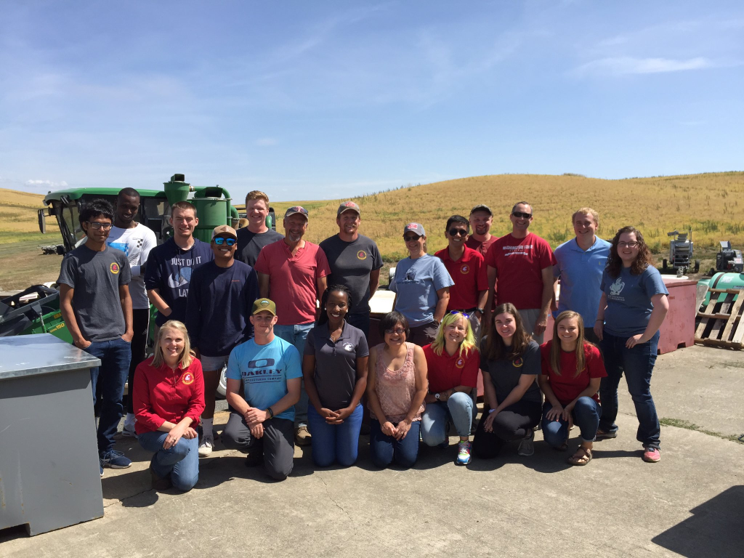

User Manual and Tutorial for WhEATBreeders
================
Lance F. Merrick
March 14, 2022

<p>

 

</p>

<p>

 

</p>

<!-- test inserting image-->

<center>



</center>

<p>

 

</p>

<center>

<font size="6"> **Wrappers for Easy Association, Tools, and Selection
for Breeders (WhEATBreeders)** </font>

</center>

<p>

 

</p>

<p>

 

</p>

### **Table of contents**

#### Introduction

#### Description of package functions

#### Getting started

#### Load Package

#### Phenotypic Data

#### Genotypic Data

#### Genomic Selection Tutorial

#### Genome-Wide Association Tutorial using GAPIT

#### Cross Prediction

#### Frequently asked questions

#### Further Information

<p>

 

</p>

<p>

 

</p>

<p>

 

</p>

### **Introduction**

WhEATBreeders was created to lower the bar for implementing genomic
selection models for plant breeders to utilize within their own breeding
programs. Not only does include functions for genotype quality control
and filtering, but it includes easy to use wrappers for the most
commonly use models in many scenarios with K-Fold cross-validation or
validation sets. You can also implement GWAS assisted genomic selection.
We created a full wrapper for quality control and genomci selection in
our function “WHEAT”. Additionaly we walk through the set up of
unrpelicated data using adjuste means and calculate cullis heritability.
We also go through multi-output and multi-trait wrappers for GWAS in
GAPIt. Finally we walk through cross-prediction using PopVar, rrBLUP,
and sommer.

### **Description of package functions**

For a full list of functions within WhEATBreeders see
“Reference\_Manual.pdf” this file contains not only the full list of
functions but also a description of each. The pdf also has each
functions arguments listed. And like with all R packages once
WhEATBreeders is installed and loaded you can type ?function\_name and
that specific function’s full descriptions will appear in the help tab
on RStudio.

### **Getting started**

First if you do not already have R and R studio installed on your
computer head over to <https://www.r-project.org/> and install the
version appropriate for you machine. Once R and R studio are installed
you will need to install the WhEATBreeders package since this is a
working package in it’s early stages of development it’s only available
through Github. To download files off Github first download and load the
library of the package “devtools” using the code below.

# Packages needed

``` r
#Better for FDR function
devtools::install_github("jiabowang/GAPIT3",force=TRUE)
library(GAPIT3)
install.packages("devtools")
devtools::install_github("jiabowang/GAPIT3",force=TRUE)
library(GAPIT3)
if (!requireNamespace("BiocManager", quietly = TRUE))
    install.packages("BiocManager")

  BiocManager::install("impute")
#From the source
require(compiler) #for cmpfun
source("http://zzlab.net/GAPIT/GAPIT.library.R")
source("http://zzlab.net/GAPIT/gapit_functions.txt") #make sure compiler is running
source("http://zzlab.net/GAPIT/emma.txt")

#Better for FDR function
devtools::install_github("jiabowang/GAPIT3",force=TRUE)
library(GAPIT3)

  library(BGLR)
  library(rrBLUP)
  library(caret)
  library(tidyr)
  library(dplyr)
  library(Hmisc)
  library(WeightIt)
  library(mpath)
  library(glmnetUtils)
  library(glmnet)
  library(MASS)
  library(Metrics)
  library(stringr)
  library(lsa)
  library(keras)
  library(tensorflow)
  library(BMTME)
  library(plyr)
  library(data.table)
  library(bigmemory)
  library(biganalytics)
  library(ggplot2)
  library(tidyverse)
  library(knitr)
  library(cvTools)
  library(vcfR)
  library(compiler)
  library(gdata)
  library(BiocManager)
  library(impute)
  library(PopVar)
  library(BLR)
  library(sommer)
  library(emmeans)
  library(heritability)
  library(arm)
  library(optimx)
  library(purrr)
  library(psych)
  library(lme4)
  library(lmerTest)
  library(gridExtra)
  library(grid)

if (!require("pacman")) install.packages("pacman")
pacman::p_load(data.table,bigmemory,biganalytics,dplyr,compiler)
```

### **Load Package**

Next using the code below download and install the package GWhEAT from
Github. The bottom two line of code in the chunk below make sure the
dependencies GWhEAT relies on are also downloaded and installed.

``` r
#install package
install_github("lfmerrick21/WhEATBreeders")
library(WhEATBreeders)#package name
```

In order to have an effective tutorial you’ll need some data to play
with, this code below downloads and loads into your environment data
used for this tutorial. \#\#\#\# Read in GBS data

``` r
if (!file.exists("GAPIT_Tutorial_Data.zip"))
{
  download.file("http://zzlab.net/GAPIT/GAPIT_Tutorial_Data.zip", destfile = "GAPIT_Tutorial_Data.zip")
  unzip("GAPIT_Tutorial_Data.zip")
}
download.file("http://zzlab.net/GAPIT/data/CROP545_Covariates.txt", destfile = "CROPS545_Covariates.txt")
download.file("http://zzlab.net/GAPIT/data/CROP545_Phenotype.txt", destfile = "CROPS545_Phenotype.txt")
# Import the GAPIT demo data genotypes
gt_scan <- data.frame(read.table("GAPIT_Tutorial_Data/mdp_numeric.txt", header = T, stringsAsFactors = F, sep = "\t", nrows = 1))
classes <- sapply(gt_scan, class)
genotypes <- data.frame(read.table("GAPIT_Tutorial_Data/mdp_numeric.txt", header = T, row.names = 1, colClasses = classes, stringsAsFactors = F, sep = "\t"))

GM <- read.table("GAPIT_Tutorial_Data/mdp_SNP_information.txt", header = T, stringsAsFactors = F, sep = "\t")
CV <- read.table("CROPS545_Covariates.txt", header = T, stringsAsFactors = F, sep = "\t")
phenotypes <- read.table("CROPS545_Phenotype.txt", header = T, stringsAsFactors = F, sep = "\t")


hapmap <- fread("https://zzlab.net/GAPIT/data/mdp_genotype_test.hmp.txt",fill=TRUE)
```

### **Phenotypic Data**

#### Read in Phenotypic Data

``` r
#Read in phenotypic files
em_trials=read.csv("C:\\Users\\lance\\OneDrive - Washington State University (email.wsu.edu)\\Documents\\Genomic Selection\\Genomic Selection Pipeline\\Selected Trials_C\\Selected Trials_Emergence\\Emergence_Trials.csv",header=TRUE)
str(em_trials)
em_trials$bloc=as.factor(em_trials$bloc)
em_trials$checks=as.factor(em_trials$checks)
em_trials$prow=as.factor(em_trials$prow)
em_trials$pcol=as.factor(em_trials$pcol)
em_trials$ibloc=as.factor(em_trials$ibloc)
em_trials$year1=as.factor(em_trials$year1)
em_trials$r_expt=as.factor(em_trials$r_expt)
colnames(em_trials)[8]<-c("Name")

#We have to create new identifiers according to the model indicated in the review paper I sent you.
em_trials$new.ind=em_trials$checks
em_trials=em_trials %>% mutate(check.ind = recode(checks,"1"="0", "0"="1"))
em_trials$check.ind=as.factor(em_trials$check.ind)
em_trials$new.ind=as.factor(em_trials$new.ind)
str(em_trials)
View(em_trials)

#I just subset the different trials I needed
lq15=subset(em_trials,em_trials$r_expt==levels(em_trials$r_expt)[2])
lq17=subset(em_trials,em_trials$r_expt==levels(em_trials$r_expt)[3])
lq18=subset(em_trials,em_trials$r_expt==levels(em_trials$r_expt)[4])
lq19=subset(em_trials,em_trials$r_expt==levels(em_trials$r_expt)[5])
lq15_17=em_trials[em_trials$r_expt == "2015 QAM Plots Lind" | em_trials$r_expt == "2017 QAM Plots Lind", ]

lq15_18=em_trials[em_trials$r_expt == "2015 QAM Plots Lind" | em_trials$r_expt == "2017 QAM Plots Lind" |em_trials$r_expt == "2018 QAM Rows Lind", ]
lq15_19=em_trials[em_trials$r_expt == "2015 QAM Plots Lind" | em_trials$r_expt == "2017 QAM Plots Lind" |em_trials$r_expt == "2018 QAM Rows Lind" |em_trials$r_expt == "2019 QAM Rows Lind", ]
```

#### Cullis Heritability (From Shantel Martinez Github)

##### Single Environment Including genotype

``` r
lq15_bp <- lmer(emer~check.ind + (1|Name:new.ind) + (1|ibloc), data=lq15)
Cullis_H2(lq15_bp)
summary(lq15_bp)
anova(lq15_bp)
ranova(lq15_bp)
```

##### Multi Environment including genotype

``` r
lq15_17_bp <- lmer(emer~check.ind + (1|Name:new.ind) + (1|ibloc)+(1|r_expt)+check.ind:r_expt + (1|Name:new.ind:r_expt) + (1|ibloc:r_expt), data=lq15_17)
Cullis_H2(lq15_17_bp)
summary(lq15_17_bp)
anova(lq15_17_bp)
ranova(lq15_17_bp)
```

\#\#\#Singularity
Problems

##### If you run into singularity or convergence problems you can always add in an lmerControl and then mess around with the maxfun number to get rid of the problem.

``` r
lb1_2_bp <- lmer(emer~check.ind + (1|Name:new.ind) + (1|ibloc)+(1|r_expt)+check.ind:r_expt + (1|Name:new.ind:r_expt) + (1|ibloc:r_expt), data=lbl1_2,
            control=lmerControl(optimizer="Nelder_Mead",
                                 optCtrl=list(maxfun=1e3)))
```

#### Adjusted Means

##### Single Environment

``` r
#Adjustments
lq15_r <- lm(emer~ibloc+checks, data=lq15)
#residuals(lq15_r)
lq15=lq15 %>% mutate(ap_adj = emer+lq15_r$residuals)
lq15_ap=aggregate(lq15[,c(21)],list(lq15$Name),mean)
colnames(lq15_ap)<-c("Name","emer_f15_ap")
```

##### Multi Environment

``` r
lq15_17_r <- lm(emer~ibloc+checks+r_expt+ibloc*r_expt+checks*r_expt, data=lq15_17)
#lq15_17_r$residuals
lq15_17=lq15_17 %>% mutate(ap_adj = emer+lq15_17_r$residuals)
lq15_17_ap=aggregate(lq15_17[,c(21)],list(lq15_17$Name),mean)
colnames(lq15_17_ap)<-c("Name","emer_15_17_ap")
```

\#Combine Environments

``` r
d1=left_join(lq15_r,lq15_17_r,by="Name")
d2=left_join(d1,lq18_raw,by="Name")
```

#### True version of Cullis heritability code that I’m working on which has been adapted from the Comparison of heritability papers and the github “<https://github.com/PaulSchmidtGit/Heritability>”. I’m still working on this code, but I figured I’d give you an overview.

##### Single Environment

``` r
g.ran <- lmer(data    = lq15,
              formula = emer~check.ind + (1|Name:new.ind) + (1|ibloc))

### handle model estimates
# to my knowledge, lme4 does not offer a function to
# extract variance-covariance-matrices for BLUPs (a.k.a. prediction error variance [PEV] matrix).
# therefore, I here manually reconstruct mixed model equation for this specific example.
# notice that this solution therefore only works for this specific model!

vc <- g.ran %>% VarCorr %>% as_tibble # extract estimated variance components (vc)

# R = varcov-matrix for error term
n <- g.ran %>% summary %>% pluck(residuals) %>% length # numer of observations
vc_e <- vc %>% filter(grp=="Residual") %>% pull(vcov)  # error vc
R    <- diag(n)*vc_e                                   # R matrix = I_n * vc_e

# G = varcov-matrx for all random effects
# subset of G regarding genotypic effects
n_g  <- g.ran %>% summary %>% pluck("ngrps") %>% pluck("Name:new.ind") # number of genotypes
vc_g <- vc %>% filter(grp=="Name:new.ind") %>% pull(vcov)              # genotypic vc
G_g  <- diag(n_g)*vc_g                                        # gen part of G matrix = I * vc.g

# subset of G regarding incomplete block effects
n_b  <- g.ran %>% summary %>% pluck("ngrps") %>% pluck("ibloc") # number of incomplete blocks
vc_b <- vc %>% filter(grp=="ibloc") %>% pull(vcov)              # incomplete block vc
G_b  <- diag(n_b)*vc_b                                              # incomplete block part of G matrix = I * vc.b

G <- bdiag(G_g, G_b) # G is blockdiagonal with G.g and G.b in this example
G <- G_g
# Design Matrices
X <- g.ran %>% getME("X") %>% as.matrix # Design matrix fixed effects
Z <- g.ran %>% getME("Z") %>% as.matrix # Design matrix random effects

# Mixed Model Equation (HENDERSON 1986; SEARLE et al. 2006)
C11 <- t(X) %*% solve(R) %*% X
C12 <- t(X) %*% solve(R) %*% Z
C21 <- t(Z) %*% solve(R) %*% X
C22 <- t(Z) %*% solve(R) %*% Z + solve(G) 

C <- rbind(cbind(C11, C12),  
           cbind(C21, C22)) %>% as.matrix # Combine components into one matrix C

# Mixed Model Equation Solutions 
C_inv <- C %>% solve# Inverse of C
dim(C_inv)
View(C_inv)
colnames(C_inv)
unique(length(levels(lq15$Name)))
lq15$Name=droplevels(lq15$Name)
C22_g <- C_inv[3:483, 3:483] # subset of C.inv that refers to genotypic BLUPs
head(C_inv)
# Mean variance of BLUP-difference from C22 matrix of genotypic BLUPs
one        <- matrix(1, nrow=n_g, ncol=1)      # vector of 1s
P_mu       <- diag(n_g, n_g) - one %*% t(one)  # P_mu = matrix that centers for overall-mean
vdBLUP_sum <- psych::tr(P_mu %*% C22_g)        # sum of all variance of differences = trace of P_mu*C22_g
vdBLUP_avg <- vdBLUP_sum * (2/(n_g*(n_g-1)))   # mean variance of BLUP-difference = divide sum by number of genotype pairs

### H2 Cullis
H2Cullis <- 1 - (vdBLUP_avg / 2 / vc_g)
H2Cullis #0.4911897
```

##### Multi Environment

``` r
g.ran <- lmer(data    = lq15_17,
              formula = emer~check.ind + (1|Name:new.ind) + (1|ibloc)+(1|r_expt)+check.ind:r_expt + (1|Name:new.ind:r_expt) + (1|ibloc:r_expt))

### handle model estimates
# to my knowledge, lme4 does not offer a function to
# extract variance-covariance-matrices for BLUPs (a.k.a. prediction error variance [PEV] matrix).
# therefore, I here manually reconstruct mixed model equation for this specific example.
# notice that this solution therefore only works for this specific model!

vc <- g.ran %>% VarCorr %>% as_tibble # extract estimated variance components (vc)

# R = varcov-matrix for error term
n <- g.ran %>% summary %>% pluck(residuals) %>% length # numer of observations
vc_e <- vc %>% filter(grp=="Residual") %>% pull(vcov)  # error vc
R    <- diag(n)*vc_e                                   # R matrix = I_n * vc_e

# G = varcov-matrx for all random effects
# subset of G regarding genotypic effects
n_g  <- g.ran %>% summary %>% pluck("ngrps") %>% pluck("Name:new.ind") # number of genotypes
vc_g <- vc %>% filter(grp=="Name:new.ind") %>% pull(vcov)              # genotypic vc
G_g  <- diag(n_g)*vc_g                                        # gen part of G matrix = I * vc.g

# subset of G regarding incomplete block effects
n_nr  <- g.ran %>% summary %>% pluck("ngrps") %>% pluck("Name:new.ind:r_expt") # number of incomplete blocks
vc_nr <- vc %>% filter(grp=="Name:new.ind:r_expt") %>% pull(vcov)              # incomplete block vc
G_nr <- diag(n_nr)*vc_nr   


n_br  <- g.ran %>% summary %>% pluck("ngrps") %>% pluck("ibloc:r_expt") # number of incomplete blocks
vc_br <- vc %>% filter(grp=="ibloc:r_expt") %>% pull(vcov)              # incomplete block vc
G_br  <- diag(n_br)*vc_br                                              # incomplete block part of G matrix = I * vc.b

n_b  <- g.ran %>% summary %>% pluck("ngrps") %>% pluck("ibloc") # number of incomplete blocks
vc_b <- vc %>% filter(grp=="ibloc") %>% pull(vcov)              # incomplete block vc
G_b <- diag(n_b)*vc_b  

n_r  <- g.ran %>% summary %>% pluck("ngrps") %>% pluck("r_expt") # number of incomplete blocks
vc_r <- vc %>% filter(grp=="r_expt") %>% pull(vcov)              # incomplete block vc
G_r <- diag(n_r)*vc_r   

G <- bdiag(G_g,G_b,G_r,G_nr,G_br) # G is blockdiagonal with G.g and G.b in this example
# Design Matrices
X <- g.ran %>% getME("X") %>% as.matrix # Design matrix fixed effects
Z <- g.ran %>% getME("Z") %>% as.matrix # Design matrix random effects
dim(X)
dim(Z)
# Mixed Model Equation (HENDERSON 1986; SEARLE et al. 2006)
C11 <- t(X) %*% solve(R) %*% X
C12 <- t(X) %*% solve(R) %*% Z
C21 <- t(Z) %*% solve(R) %*% X
C22 <- t(Z) %*% solve(R) %*% Z + solve(G) 
dim(C11)
dim(C12)
dim(C21)
dim(C22)
dim(G)
C <- rbind(cbind(C11, C12),  
           cbind(C21, C22)) %>% as.matrix # Combine components into one matrix C

# Mixed Model Equation Solutions 
C_inv <- C %>% solve# Inverse of C
dim(C_inv)
colnames(C_inv)[1447]
lq15_17$Name=droplevels(lq15_17$Name)
unique(length(levels(lq15_17$Name)))
unique(length(levels(lq15_17$ibloc)))
unique(length(levels(lq15_17$checks)))

C22_g <- C_inv[967:1447, 967:1447] # subset of C.inv that refers to genotypic BLUPs
# Mean variance of BLUP-difference from C22 matrix of genotypic BLUPs
one        <- matrix(1, nrow=n_g, ncol=1)      # vector of 1s
P_mu       <- diag(n_g, n_g) - one %*% t(one)  # P_mu = matrix that centers for overall-mean
vdBLUP_sum <- psych::tr(P_mu %*% C22_g)        # sum of all variance of differences = trace of P_mu*C22_g
vdBLUP_avg <- vdBLUP_sum * (2/(n_g*(n_g-1)))   # mean variance of BLUP-difference = divide sum by number of genotype pairs

### H2 Cullis
H2Cullis <- 1 - (vdBLUP_avg / 2 / vc_g)
H2Cullis #0.4911897
```

# Phenotypic data wide to long format

``` r
Phenotype=Phenotype[,-1]
Phenotype1=Phenotype %>%
  pivot_longer(!Genotype, names_to = "Env", values_to = "EM")
Phenotype=Phenotype1
```

#### **Genotypic Data**

##### Read in Genotype Data and/or Phenotype Data

``` r
library(data.table)
Genotype<-fread("F:\\OneDrive\\OneDrive - Washington State University (email.wsu.edu)\\Documents\\Genomic Selection\\Genomic Selection Pipeline\\Jason_GBS\\WAC_2016-2020_production_filt.hmp.txt",fill=TRUE)
Phenotype<-fread("F:\\OneDrive\\OneDrive - Washington State University (email.wsu.edu)\\Documents\\Genomic Selection\\Genomic Selection Pipeline\\GS-Complex-Traits\\BL_EM_Pheno.csv",header=T)
```

##### Name Study

``` r
Study="Tutorial"
```

##### Obtain

``` r
Pheno_Names=Phenotype
names(Pheno_Names)[1]<-"Taxa"
Pheno_Names$Taxa=as.character(Pheno_Names$Taxa)
gname=as.vector(Pheno_Names$Taxa)
gname<-clean_names(gname)
```

##### IF VCF

##### Read in VCF

##### Currently do not have a VCF file in the folder

``` r
#setwd("F:/OneDrive/OneDrive - Washington State University (email.wsu.edu)/Documents/Genomic Selection/Genomic Selection Pipeline/GWAS Pipeline")
Xvcf=read.vcfR(Genotype)
Xvcf@fix
Xvcf@gt
```

#### Convert to Numeric

``` r
Xbgl=data.frame(Xvcf@fix,Xvcf@gt)
genotypes_num<- VCF_2_numeric(Genotype)
GD=genotypes_num$genotypes
names.use <- names(GD)[(names(GD) %in% gname)]
GD <- GD[, names.use, with = FALSE]
GI=genotypes_num$marker_map
GT

#Save Raw Files
fwrite(GT,paste0(Study,"_GT_taxa.csv"))
fwrite(GD,paste0(Study,"_GD_numeric_Raw.csv"))
fwrite(GI,paste0(Study,"_GI_map_Raw.csv"))
save(GD,GI,GT,file=paste0(Study,"_Raw.RData"))
```

The majority of this code is my pipeline I use to take a hapmap file,
convert it to numeric, filter and impute it. If you just want the code
for what I use for kamiak, you can just skip to the bottom or look at
the R Script I provided.

##### IF Hapmap

#### Filter GBS for Phenotype data

``` r
names.use <- names(Genotype)[(names(Genotype) %in% gname)]
hapmap <- Genotype[, names.use, with = FALSE]
hapmap=cbind(Genotype[,1:11],hapmap)
#str(output)
hapmap[hapmap=="NA"]<-"NA"
hapmap$`assembly#`=as.character(hapmap$`assembly#`)
hapmap$center=as.character(hapmap$center)
hapmap$protLSID=as.character(hapmap$protLSID)
hapmap$assayLSID=as.character(hapmap$assayLSID)
hapmap$panelLSID=as.character(hapmap$panelLSID)
hapmap$QCcode=as.character(hapmap$QCcode)
dim(hapmap)
#Save filtered hapmap
save(hapmap,file=paste0(Study,"_Filtered_Hapmap.RData"))
fwrite(hapmap,paste0(Study,"_Filtered_Hapmap.hmp.txt"),sep="\t",row.names = FALSE,col.names = TRUE)
```

#### Convert to Numeric

``` r
#If you want to impute with mean
outG=GAPIT.HapMap(hapmap,SNP.impute="Middle")
#If you want to use a different imputation method
outG=GAPIT.HapMap(hapmap,SNP.impute="None")
GT=outG$GT
GT=data.frame(V1=rownames(GT),GT)
GD=outG$GD
GI=outG$GI
rownames(GD)=rownames(GT)
colnames(GD)=GI$SNP
#Save Raw Files
fwrite(GT,paste0(Study,"_GT_taxa.csv"))
fwrite(GD,paste0(Study,"_GD_numeric_Raw.csv"))
fwrite(GI,paste0(Study,"_GI_map_Raw.csv"))
save(GD,GI,GT,file=paste0(Study,"_Raw.RData"))
```

#### Filter Remove Missing Data \>20%, MAF \<5% and Monomorphic Markers and Lines with more than 80% missing

``` r
Missing_Rate=0.20
MAF=0.05
Missing_Rate_Ind=0.80
```

#### Filter

##### Remove makers with more than 20% missing

``` r
##### Remove makers based on missing data
mr=calc_missrate(GD)
mr_indices <- which(mr > Missing_Rate)
if(length(mr_indices)!=0){
  GDmr = GD[,-mr_indices]
  GImr = GI[-mr_indices,]
  }else{
    GDmr = GD
    GImr = GI
  }
  dim(GDmr)
  dim(GImr)
```

##### Remove Monomorphic Markers

``` r
##### Remove Monomorphic Markers
maf <- calc_maf_apply(GDmr, encoding = c(0, 1, 2))
mono_indices <- which(maf ==0)
if(length(mono_indices)!=0){
  GDmo = GDmr[,-mono_indices]
  GImo = GImr[-mono_indices,]
  }else{
    GDmo = GDmr
    GImo = GImr
  }
  dim(GDmo)
  dim(GImo)
```

##### Remove MAF \<5%

``` r
##### Remove MAF
maf <- calc_maf_apply(GDmo, encoding = c(0, 1, 2))
mono_indices <- which(maf < MAF)
if(length(mono_indices)!=0){
  GDmf = GDmo[,-mono_indices]
  GImf = GImo[-mono_indices,]
  }else{
    GDmf = GDmo
    GImf = GImo
  }
  dim(GDmf)
  dim(GImf)
```

##### Filter Individuals

``` r
mr=calc_missrate(t(GDmf))
mr_indices <- which(mr > Missing_Rate_Ind)
if(length(mr_indices)!=0){
  GDmf = GDmf[-mr_indices,]
  GT=GT[-mr_indices,]
  }else{
    GDmf = GDmf
    GT=GT
    }
    dim(GDmf)
    dim(GImf)
```

#### Imputation

##### Imputation Using BEAGLE

``` r
GImf$chr <- GImf$Chromosome
GImf$rs <- GImf$SNP
GImf$pos <- GImf$Position

LD_file <- paste0(Study)
vcf_LD <- numeric_2_VCF(GDmf, GImf)
write_vcf(vcf_LD, outfile = LD_file)#Exports vcf
# Assign parameters
genotype_file = paste0(Study,".vcf")
outfile = paste0(Study,"_imp")

# Define a system command
command1_prefix <- "java -jar beagle.25Nov19.28d.jar"
command_args <- paste(" gt=", genotype_file, " out=", outfile, sep = "")
command1 <- paste(command1_prefix, command_args)
test <- system(command1)
# Run BEAGLE using the system function, this will produce a gzip .vcf file
Xvcf=read.vcfR(paste0(Study,"_imp",".vcf.gz"))
Xbgl=data.frame(Xvcf@fix,Xvcf@gt)
genotypes_imp <- VCF_2_numeric(Xbgl)[[1]]
#Pre-imputed genotype matrix
dim(GDmf)
sum(is.na(GDmf))
#Imputed genotype matrix
dim(genotypes_imp)
sum(is.na(genotypes_imp))

#Remove MAF <5%
maf <- calc_maf_apply(genotypes_imp, encoding = c(0, 1, 2))
mono_indices <- which(maf < MAF)

if(length(mono_indices)!=0){
  GDre = genotypes_imp[,-mono_indices]
  GIre = GImf[-mono_indices,]
  }else{
  GDre = genotypes_imp
  GIre = GImf
  }

  GIre=GIre[,1:3]
  dim(GDre)
  dim(GIre)

fwrite(GDre,paste0(Study,"_GD_Filt_Imputed.csv"))
fwrite(GIre[,1:3],paste0(Study,"_GI_Filt_Imputed.csv"))
save(GDre,GIre,GT,file=paste0(Study,"_Filt_Imputed.RData"))
dim(GDre)
dim(GIre)
dim(GT)
```

##### Or Impute with KNN

``` r
x=impute::impute.knn(as.matrix(t(GDmf)))
myGD_imp=t(x$data)
myGD_imp<-round(myGD_imp,0)
sum(is.na(myGD_imp))
#Filter again
#Remove MAF <5%
maf <- calc_maf_apply(myGD_imp, encoding = c(0, 1, 2))
mono_indices <- which(maf < MAF)
if(length(mono_indices)!=0){
  GDre = myGD_imp[,-mono_indices]
  GIre = GImf[-mono_indices,]
  }else{
    GDre = myGD_imp
    GIre = GImf
  }
 dim(GDre)
dim(GIre)

fwrite(GDre,paste0(Study,"_GD_Filt_Imputed.csv"))
fwrite(GIre[,1:3],paste0(Study,"_GI_Filt_Imputed.csv"))
save(GDre,GIre,GT,file=paste0(Study,"_Filt_Imputed.RData"))
```

### **START HERE IF GENOTYPE DATA IS DONE**

#### This gets into my own files This section gets your data in order but using a function

#### Function to get data in order as above chunck but integrated into a function to also combine all files for a nice list with PCs included.

``` r
CV=NULL
PC=NULL
Trait="EM"
Study="Tutorial"
Outcome="Tested" #Tested or Untested
Trial=c("F5_2015","DH_2020","BL_2015_2020")
Scheme="K-Fold"
Method="Two-Step"
#load phenotypic and genotypic data in.
##########PG################################
                    if(Method=="Two-Step"){
                      if(!is.null(CV)){
                        GBS.list=c()
                        for(i in 1:length(Trial)){
                          Pheno=Phenotype %>% filter(Env %in% c(Trial[i]))
                          Pheno=Pheno[,c("Genotype","Env",Trait)]
                          for(j in 1:length(Trait)){
                            Pheno<-Pheno[complete.cases(Pheno[,Trait[j]]),]
                            GBS<<-PGandCV(Pheno[,c("Genotype",Trait[j])],GDre,GT,GIre,CV)
                            mv(from = "GBS", to = paste0("GBS_2_CV_",Trial[i],"_",Trait[j]),envir = globalenv())

                            GBS.list=c(GBS.list,paste0("GBS_2_CV_",Trial[i],"_",Trait[j]))
                            #save(list=paste0("GBS_2_CV_",Trial[i],"_",Trait[j]),file=paste0("GBS_2_CV_",Trial[i],"_",Trait[j],".RData"))
                          }

                        }
                        save(list = GBS.list, file=paste0("GBS_2_CV_",Study,".RData"))
                      }else{
                        GBS.list=c()
                        for(i in 1:length(Trial)){
                          Pheno=Phenotype %>% filter(Env %in% c(Trial[i]))
                          Pheno=Pheno[,c("Genotype","Env",Trait)]
                          for(j in 1:length(Trait)){
                            Pheno<-Pheno[complete.cases(Pheno[,Trait[j]]),]
                            GBS<<-PandG(Pheno[,c("Genotype",Trait[j])],GDre,GT,GIre)
                            mv(from = "GBS", to = paste0("GBS_2_",Trial[i],"_",Trait[j]),envir = globalenv())

                            GBS.list=c(GBS.list,paste0("GBS_2_",Trial[i],"_",Trait[j]))
                            #save(list=paste0("GBS_2_",Trial[i],"_",Trait[j]),file=paste0("GBS_2_",Trial[i],"_",Trait[j],".RData"))
                          }

                        }
                        save(list = GBS.list, file=paste0("GBS_2_",Study,".RData"))
                      }

                      if(Outcome=="Untested"){
                        if(!is.null(CV)){
                          GBS.list=c()
                          for(i in 1:length(Trial)){
                            Pheno=Phenotype %>% filter(Env %in% c(Trial[i]))
                            Pheno=Pheno[,c("Genotype","Env",Trait)]
                            for(j in 1:length(Trait)){
                              #Pheno<-Pheno[complete.cases(Pheno[,Trait[j]]),c(1,Trait[j])]
                              GBS<<-PGandCV(Pheno[,c("Genotype",Trait[j])],GDre,GT,GIre,CV)
                              mv(from = "GBS", to = paste0("GBS_2_CV_Untested_",Trial[i],"_",Trait[j]),envir = globalenv())

                              GBS.list=c(GBS.list,paste0("GBS_2_CV_Untested_",Trial[i],"_",Trait[j]))
                              #save(list=paste0("GBS_2_CV_",Trial[i],"_",Trait[j]),file=paste0("GBS_2_CV_",Trial[i],"_",Trait[j],".RData"))
                            }

                          }
                          save(list = GBS.list, file=paste0("GBS_2_CV_Untested_",Study,".RData"))
                        }else{
                          GBS.list=c()
                          for(i in 1:length(Trial)){
                            Pheno=Phenotype %>% filter(Env %in% c(Trial[i]))
                            Pheno=Pheno[,c("Genotype","Env",Trait)]
                            for(j in 1:length(Trait)){
                              #Pheno<-Pheno[complete.cases(Pheno[,Trait[j]]),c(1,Trait[j])]
                              GBS<<-PandG(Pheno[,c("Genotype",Trait[j])],GDre,GT,GIre)
                              mv(from = "GBS", to = paste0("GBS_2_Untested_",Trial[i],"_",Trait[j]),envir = globalenv())

                              GBS.list=c(GBS.list,paste0("GBS_2_Untested_",Trial[i],"_",Trait[j]))
                              #save(list=paste0("GBS_2_",Trial[i],"_",Trait[j]),file=paste0("GBS_2_",Trial[i],"_",Trait[j],".RData"))
                            }

                          }
                          save(list = GBS.list, file=paste0("GBS_2_Untested_",Study,".RData"))
                        }
                      }
                    }

                    if(Method=="One-Step"){
                      if(!is.null(CV)){
                        Pheno=Phenotype %>% filter(Env %in% c(Trial))
                        Pheno=Phenotype[,c("Genotype","Env",Trait)]
                        GBS<<-PGEandCV(Pheno,GDre,GT,GIre,CV)
                        mv(from = "GBS", to = paste0("GBS_1_CV_",Study),envir = globalenv())
                        save(list=paste0("GBS_1_CV_",Study),file=paste0("GBS_1_CV_",Study,".RData"))
                      }else{
                        Pheno=Phenotype %>% filter(Env %in% c(Trial))
                        Pheno=Phenotype[,c("Genotype","Env",Trait)]
                        GBS<<-PGandE(Pheno,GDre,GT,GIre)
                        mv(from = "GBS", to = paste0("GBS_1_",Study),envir = globalenv())
                        save(list=paste0("GBS_1_",Study),file=paste0("GBS_1_",Study,".RData"))
                      }
                    }
                    if(Method=="One-Step"){
                      Matrix<<-GE_Matrix_IND(genotypes=get(paste0("GBS_1_",Study,"$geno")), 
                      phenotype=get(paste0("GBS_1_",Study,"$pheno")),trait=Trait,GE=GE,UN=UN,model=GE_model)
                      mv(from = "Matrix", to = paste0("Matrix_",Study,GE_model),envir = globalenv())
                      save(list=paste0("Matrix_",Study),file=paste0("Matrix_",Study,".RData"))
                    }
```

#### Or we can do all of this with the wrapper WHEAT function

##### Make QC=TRUE and GS=FALSE

``` r
LIND_QC=WHEAT(Phenotype=Phenotype,
                Genotype=Genotype,
                QC=TRUE,
                GS=FALSE,
                #QC Info
                Geno_Type="Hapmap",
                Imputation="Beagle",
                Filter=TRUE,
                Missing_Rate=0.20,
                MAF=0.05,
                Filter_Ind=TRUE,
                Missing_Rate_Ind=0.80,
                #If QC Info is FALSE
                GDre=NULL,
                GT=NULL,
                GIre=NULL,
                #GDre=GDre,
                #GT=GT,
                #GIre=GIre,
                GBS_Train=GBS_2_F5_2015_EM,
                GBS_Predict=GBS_2_Untested_DH_2020_EM,
                #GS Info
                Type="Regression",
                Replications=2,
                Training="F5_2015",
                Prediction="DH_2020",
                CV=NULL,
                PC=NULL,
                Trait="EM",
                Study="Tutorial",
                Outcome="Tested", #Tested or Untested
                #Trial=c("F5_2015","DH_2020","BL_2015_2020"),
                Trial=c("F5_2015","DH_2020"),
                Scheme="K-Fold",#K-Fold or VS
                Method="Two-Step", #Two-Step or #One-Step
                Package="rrBLUP",
                model="rrBLUP",
                Kernel="Markers",
                markers=NULL,
                folds = 5,
                nIter = 1500,
                burnIn = 500,
                Sparse=FALSE,
                m=NULL,
                degree=NULL,
                nL=NULL,
                transformation="none",
                #GAGS Info
                GAGS=FALSE,
                PCA.total=3,
                QTN=10,
                GWAS=c("BLINK"),
                alpha=0.05,
                threshold=NULL,
                GE=TRUE,
                UN=FALSE,
                GE_model="MTME",
                sampling="up",
                repeats=5,
                method="repeatedcv",
                Messages=TRUE)
```

### **Genomic Selection Tutorial**

### Optional Input

#### if you want to use the numeric files

##### GDre (Numeric Matrix from output)

##### GT (Taxa file from output)

##### GIre (Map file from output)

##### GBS\_Train (GBS RData output you want to use for training population)

##### GBS\_Predict (GBS RData output you want to use for validation set if you’re using VS)

### Multipe Trait Output

#### Method: “Two-Step”

#### Scheme: Cross-Validation (“K-Fold”) or Validation Sets (“VS”)

#### fold (Number of folds in K-Fold)

#### Training (Select trial for training population)

#### Prediction (Select trial if using validation sets)

#### Outcome: “Tested” or “Untested”

##### Tested allows predictions and accuracy and error comparisons

##### Untested for new predictions without comparisons

#### Packages: “rrBLUP”, “MAS”, “BGLR”, “caret”, “GLM”,

#### Type: “Regression” or “Classification” with caret package

#### Models: rrBLUP, MAS, BGLR(BayesA,BayesB,BayesC,BayesL,BayesRR,RKHS, Ordinal), caret(any model available in the caret package), GAPIT(gBLUP,cBLUP, or sBLUP)

#### nIter (Number of iterations for BGLR models)

#### burnIn (Number of burn-ins for BGLR models)

#### With/without Principal Components (“PC”: Number included or NULL)

#### With/without Covariates (“CV”: CV set (Genotypes and CVs) or NULL)

#### Phenotype transformation (“none”,“sqrt”,“log”,“boxcox”)

#### Subsampling of markers (markers: Number of markers to sample or NULL)

#### Kernel (“Markers”,“Linear”,Gaussian“,”Polynomial“,”Sigmoid“,”Arc-cosine with 1 layer or multiple layers:nl (“AK1”,“AKL”),“Exponential”)

#### Kernel (caret package allows above kernels with addition of “VanRaden”,“PC”,“Zhang”,“Endelman”(A-mat),)

#### nl (Number of layers for arc-cosine kernel)

#### degree (degree for polynomial kernel)

#### Sparse Matrix (Sparese=TRUE or FALSE)

#### m (Number of lines to keep in sparse matrix)

#### Replications (Number of Replications)

#### GWAS-Assisted GS (GAGS:TRUE or FALSE)

#### PCA.total (Number of PCs for GAGS and GAPIT models)

#### QTN (Number of top QTN or markers to include for GAGS)

#### GWAS (GWAS model for GAGS c(“BLINK) or any GAPIT model) \#\#\#\# threshold (”Bonferonni" or NULL for GAGS)

#### alpha (0.5, or any other threshold for Bonferonni for GAGS)

#### Messages (TRUE or FALSE)

#### All of the above can be done with the wrapper function WHEAT

#### Option shown below displays the function after QC and just GS with the GBS RData as input for validation sets using Two-step rrBLUP

``` r
F515_DH20=WHEAT(Phenotype=Phenotype1,
                Genotype=Genotype,
                QC=FALSE,
                GS=TRUE,
                #QC Info
                Geno_Type="Hapmap",
                Imputation="Beagle",
                Filter=TRUE,
                Missing_Rate=0.20,
                MAF=0.05,
                Filter_Ind=TRUE,
                Missing_Rate_Ind=0.80,
                #If QC Info is FALSE
                GDre=NULL,
                GT=NULL,
                GIre=NULL,
                #GDre=GDre,
                #GT=GT,
                #GIre=GIre,
                GBS_Train=GBS_2_F5_2015_EM,
                GBS_Predict=GBS_2_Untested_DH_2020_EM,
                #GS Info
                Type="Regression",
                Replications=2,
                Training="F5_2015",
                Prediction="DH_2020",
                CV=NULL,
                PC=NULL,
                Trait="EM",
                Study="Tutorial",
                Outcome="Untested", #Tested or Untested
                #Trial=c("F5_2015","DH_2020","BL_2015_2020"),
                Trial=c("F5_2015","DH_2020"),
                Scheme="VS",
                Method="Two-Step",
                Package="rrBLUP",
                model="rrBLUP",
                Kernel="Markers",
                markers=NULL,
                folds = 5,
                nIter = 1500,
                burnIn = 500,
                Sparse=FALSE,
                m=NULL,
                degree=NULL,
                nL=NULL,
                transformation="none",
                #GAGS Info
                GAGS=FALSE,
                PCA.total=3,
                QTN=10,
                GWAS=c("BLINK"),
                alpha=0.05,
                threshold=NULL,
                GE=TRUE,
                UN=FALSE,
                GE_model="MTME",
                sampling="up",
                repeats=5,
                method="repeatedcv",
                Messages=TRUE)
```

#### If you want to look at individual functions

### Options with rrBLUP

#### GS with K-Fold with all opotions

``` r
Results=sapply(1:Replications, function(i,...){Results=rrBLUP_CV(genotypes = GBS_Train$geno,
                                                                                                   phenotype = GBS_Train$pheno,
                                                                                                   Kernel="Markers",
                                                                                                   PCA=GBS_Train$PC[,1:PC],
                                                                                                   CV=GBS_Train$CV[,-1],
                                                                                                   markers=NULL,
                                                                                                   folds = 5,
                                                                                                   Sparse=FALSE,
                                                                                                   m=NULL,
                                                                                                   degree=NULL,
                                                                                                   nL=NULL,
                                                                                                   transformation="none"
                                  )})
```

#### rrBLUP Validation sets with all options

``` r
Results=sapply(1:Replications, function(i,...){Results=rrBLUP_VS(train_genotypes = GBS_Train$geno,
                                                                                                   train_phenotype = GBS_Train$pheno,
                                                                                                   train_PCA=GBS_Train$PC[,1:PC],
                                                                                                   train_CV=GBS_Train$CV[,-1],
                                                                                                   test_genotypes= GBS_Predict$geno,
                                                                                                   test_phenotype= GBS_Predict$pheno,
                                                                                                   test_PCA=GBS_Predict$PC[,1:PC],
                                                                                                   test_CV=GBS_Predict$CV[,-1],
                                                                                                   Kernel="Markers",
                                                                                                   markers=NULL,
                                                                                                   Sparse=FALSE,
                                                                                                   m=NULL,
                                                                                                   degree=NULL,
                                                                                                   nL=NULL,
                                                                                                   transformation="none"
                                  )})
```

#### rrBLUP with GAGS in K-Fold

``` r
Results=sapply(1:Replications, function(i,...){Results=rrBLUP_GAGS_CV(genotypes = GBS_Train$geno,
                                                                                                      phenotype = GBS_Train$pheno,
                                                                                                      Kernel="Markers",
                                                                                                      PCA=GBS_Train$PC[,1:PC],
                                                                                                      CV=NULL,
                                                                                                      markers=NULL,
                                                                                                      folds = 5,
                                                                                                      Sparse=FALSE,
                                                                                                      m=NULL,
                                                                                                      degree=NULL,
                                                                                                      nL=NULL,
                                                                                                      transformation="none",
                                                                                                      Y=GBS_Train$pheno,
                                                                                                      GM=GBS_Train$map,
                                                                                                      GD=GBS_Train$numeric,
                                                                                                      GWAS=c("BLINK"),
                                                                                                      alpha=0.5,
                                                                                                      threshold="Bonferonni",
                                                                                                      QTN=NULL,
                                                                                                      PCA.total=3
                                )})
```

### Classification with caret in K-Fold

``` r
Results=sapply(1:Replications, function(i,...){Results=Caret_Models_CV(genotypes = GBS_Train$geno,
                                                                                                   phenotype = GBS_Train$pheno,
                                                                                                   type="Classification",
                                                                                                   model="SVM",
                                                                                                   Kernel="VanRaden",
                                                                                                   markers=NULL,
                                                                                                   folds = 5,
                                                                                                   Sparse=FALSE,
                                                                                                   m=NULL,
                                                                                                   degree=NULL,
                                                                                                   nL=NULL,
                                                                                                   transformation="none",
                                                                                                   sampling="up",
                                                                                                   repeats=5,
                                                                                                   method="repeatedcv"
                            )})
```

#### R Script for Kamiak

``` r
  source("FUNCTIONS_GS_COMP.R")
  load(file ='GBS_2_Tutorial.RData')
  library(dplyr)
  library(rrBLUP)
  library(BGLR)
  library(tidyr)
  library(caret)
  library(Metrics)
  library(mpath)

library(parallel)
cores=10
cl <- makeForkCluster(cores)
clusterSetRNGStream(cl)

Results=parSapply(cl, 1:50, function(i,...){Results=rrBLUP_CV(genotypes = GBS_Train$geno,
                                                                                                   phenotype = GBS_Train$pheno,
                                                                                                   Kernel="Markers",
                                                                                                   PCA=GBS_Train$PC[,1:PC],
                                                                                                   CV=GBS_Train$CV[,-1],
                                                                                                   markers=NULL,
                                                                                                   folds = 5,
                                                                                                   Sparse=FALSE,
                                                                                                   m=NULL,
                                                                                                   degree=NULL,
                                                                                                   nL=NULL,
                                                                                                   transformation="none"
                                  )
save(Results,file=paste0("Results_",i,".RData"))
Results})

stopCluster(cl)
save(Results,file = "Results.RData")
```

### **Genome-Wide Association Tutorial using GAPIT**

#### load GBS data ouput form WHEAT

``` r
load(file='GBS_2_Tutorial.RData')
```

#### Model Selection in GAPIT (aka PC number selection)

``` r
#QAM
myGAPIT_MS<- GAPIT(Y = GBS_qam_adj18$pheno[,c(1,18)],
                         GD = GBS_qam_adj18$numeric,
                         GM = GBS_qam_adj18$map,
                         model = "MLM",
                         PCA.total=3,
                         Model.selection = TRUE,
                         file.output=T)
```

#### GAPIT

``` r
myGAPIT_BLINK_qam_adj_23<- GAPIT(Y = GBS_qam_adj23$pheno[,c(1,23)],
                         GD = GBS_qam_adj23$numeric,
                         GM = GBS_qam_adj23$map,
                         PCA.total=3,
                         model = "BLINK",
                         file.output=T)
#I like saving the results in a R data file.
save(myGAPIT_BLINK_qam_adj_23,file="GWAS_EM_QAM_ADJ_BLINK_ZZ_Redo_5_11.RData")

myGAPIT_BLINK_adj_13<- GAPIT(Y = GBS_adj13$pheno[,c(1,13)],
                         GD = GBS_adj13$numeric,
                         GM = GBS_adj13$map,
                         PCA.total=3,
                         model = "BLINK",
                         file.output=T)
save(myGAPIT_BLINK_adj_13,file="GWAS_EM_adj_BLINK_ZZ_Redo_5_11.RData")

FarmCPU_qam_adj_23<- GAPIT(Y = GBS_qam_adj23$pheno[,c(1,23)],
                         GD = GBS_qam_adj23$numeric,
                         GM = GBS_qam_adj23$map,
                         PCA.total=3,
                         model = "FarmCPU",
                         file.output=T)
save(FarmCPU_qam_adj_23,file="GWAS_EM_QAM_ADJ_ZZ_FarmCPU_Redo_5_11.RData")

FarmCPU_adj_13<- GAPIT(Y = GBS_adj13$pheno[,c(1,13)],
                         GD = GBS_adj13$numeric,
                         GM = GBS_adj13$map,
                         PCA.total=3,
                         model = "FarmCPU",
                         file.output=T)
save(FarmCPU_adj_13,file="GWAS_EM_adj_ZZ_FarmCPU_Redo_5_11.RData")

myGAPIT_MLM_qam_adj_23<- GAPIT(Y = GBS_qam_adj23$pheno[,c(1,23)],
                         GD = GBS_qam_adj23$numeric,
                         GM = GBS_qam_adj23$map,
                         PCA.total=3,
                         model = c("MLM"),
                         file.output=T)
save(myGAPIT_MLM_qam_adj_23,file="GWAS_EM_QAM_ADJ_MLM_ZZ_Redo_5_11.RData")
myGAPIT_MLM_adj_13<- GAPIT(Y = GBS_adj13$pheno[,c(1,13)],
                         GD = GBS_adj13$numeric,
                         GM = GBS_adj13$map,
                         PCA.total=3,
                         model = c("MLM"),
                         file.output=T)
save(myGAPIT_MLM_adj_13,file="GWAS_EM_adj_MLM_ZZ_Redo_5_11.RData")
```

#### Marker effects and variation

##### This can be either FDR or Bonferonni

``` r
BLINK_Effects=Marker_Effects(Pheno=myY[,2],GWAS=myGAPIT_BLINK_qam_adj_23,alpha=0.05,correction="Bonferonni",messages=TRUE,model="BLINK")
BLINK_Effects
```

##### Read in Hapmap

``` r
load(file="EM_Hapmap_Redo.RData")
output[1:10,1:14]
#Extract Map and Allele Information
EM_GBS_SNPs=output[,1:5]
```

This version is much better but requires a hapmap. It creates a nice
table with alleles in which allows you to identify the favorable allele.
The numericalization makes the 2 the allele second in alphabetical
order. If it is A/T then A=0 and T=2. So if the marker effect is
negative such as -2, then A is the favorable allele because -2 is the
effect of the T allele.

#### Calculate Effects

#### This can be either FDR or Bonferonni

IF you prefer the online functions for gapit, you will need to remove
all functions from the website since they don’t all work. I use gapit
functions in the below function. So to make it work, download the Github
version if you did not do that above.

``` r
#This removes just functions.
#rm(list=lsf.str())
#install.packages("devtools")
#devtools::install_github("jiabowang/GAPIT3",force=TRUE)
#library(GAPIT3)
FDR_sig_B6 <- Marker_Effects_Allele(Pheno=GBS_qam_adj23$pheno[,c(23)],GWAS=myGAPIT_BLINK_qam_adj_23,alpha=0.05,correction="FDR",messages=TRUE,Markers=EM_GBS_SNPs)
FDR_sig_B6
FDR_sig_F6 <- Marker_Effects_Allele(Pheno=GBS_qam_adj23$pheno[,c(23)],GWAS=FarmCPU_qam_adj_23,alpha=0.05,correction="FDR",messages=TRUE,Markers=EM_GBS_SNPs)
FDR_sig_F6
FDR_sig_M6 <- Marker_Effects_Allele(Pheno=GBS_qam_adj23$pheno[,c(23)],GWAS=myGAPIT_MLM_qam_adj_23,alpha=0.05,correction="FDR",messages=TRUE,Markers=EM_GBS_SNPs,model="MLM")
FDR_sig_M6
FDR_sig_B1_bl <- Marker_Effects_Allele(Pheno=GBS_adj13$pheno[,c(13)],GWAS=myGAPIT_BLINK_adj_13,alpha=0.05,correction="FDR",messages=TRUE,Markers=EM_GBS_SNPs)
FDR_sig_B1_bl
FDR_sig_F1_bl <- Marker_Effects_Allele(Pheno=GBS_adj13$pheno[,c(13)],GWAS=FarmCPU_adj_13,alpha=0.05,correction="FDR",messages=TRUE,Markers=EM_GBS_SNPs)
FDR_sig_F1_bl
FDR_sig_M1_bl <- Marker_Effects_Allele(Pheno=GBS_adj13$pheno[,c(13)],GWAS=myGAPIT_MLM_adj_13,alpha=0.05,correction="FDR",messages=TRUE,Markers=EM_GBS_SNPs,model="MLM")
FDR_sig_M1_bl
```

#### Secondary Trait

This is for another trait that I don’t want to create a manhattan plot
but overlay significant markers within the other manhattan
pltos

``` r
FDR_sig_B1_Col_Len_blup=Marker_Effects_Allele(Pheno=GBS_qam_adj18$CV[,c(6)],GWAS=BLINK_Col_Length_qam_blup_18,alpha=0.05,correction="FDR",messages=TRUE,Markers=EM_GBS_SNPs,model="BLINK")
FDR_sig_F1_Col_Len_blup=Marker_Effects_Allele(Pheno=GBS_qam_adj18$CV[,c(6)],GWAS=FarmCPU_Col_Length_qam_blup_18,alpha=0.05,correction="FDR",messages=TRUE,Markers=EM_GBS_SNPs,model="FarmCPU")
FDR_sig_M1_Col_Len_blup=Marker_Effects_Allele(Pheno=GBS_qam_adj18$CV[,c(6)],GWAS=MLM_Col_Length_qam_blup_18,alpha=0.05,correction="FDR",messages=TRUE,Markers=EM_GBS_SNPs,model="MLM")
Col_lenth=union(FDR_sig_B1_Col_Len_blup$SNP,FDR_sig_F1_Col_Len_blup$SNP)
```

I reacreated the manahttan plots from the gapit code using ggplot which
allows for far more customization, and the ability to edit the plot
after it is initially made.

I did this to allow easy labeling and allow multiple traits/models from
two different GWAS results to be
overlaid.

#### First you need to change Numeric to Number and Letter Chromosomes

``` r
FarmCPU_qam_adj_23$GWAS=FarmCPU_qam_adj_23$GWAS%>%mutate(Chromosome=recode(Chromosome,"1"="1A","2"="1B","3"="1D","4"="2A","5"="2B","6"="2D","7"="3A","8"="3B","9"="3D","10"="4A","11"="4B","12"="4D","13"="5A","14"="5B","15"="5D","16"="6A","17"="6B","18"="6D","19"="7A","20"="7B","21"="7D","22"="UN"))  
  
FarmCPU_adj_13$GWAS=FarmCPU_adj_13$GWAS%>%mutate(Chromosome=recode(Chromosome,"1"="1A","2"="1B","3"="1D","4"="2A","5"="2B","6"="2D","7"="3A","8"="3B","9"="3D","10"="4A","11"="4B","12"="4D","13"="5A","14"="5B","15"="5D","16"="6A","17"="6B","18"="6D","19"="7A","20"="7B","21"="7D","22"="UN"))

myGAPIT_BLINK_qam_adj_23$GWAS=myGAPIT_BLINK_qam_adj_23$GWAS%>%mutate(Chromosome=recode(Chromosome,"1"="1A","2"="1B","3"="1D","4"="2A","5"="2B","6"="2D","7"="3A","8"="3B","9"="3D","10"="4A","11"="4B","12"="4D","13"="5A","14"="5B","15"="5D","16"="6A","17"="6B","18"="6D","19"="7A","20"="7B","21"="7D","22"="UN"))  
  
myGAPIT_BLINK_adj_13$GWAS=myGAPIT_BLINK_adj_13$GWAS%>%mutate(Chromosome=recode(Chromosome,"1"="1A","2"="1B","3"="1D","4"="2A","5"="2B","6"="2D","7"="3A","8"="3B","9"="3D","10"="4A","11"="4B","12"="4D","13"="5A","14"="5B","15"="5D","16"="6A","17"="6B","18"="6D","19"="7A","20"="7B","21"="7D","22"="UN"))

myGAPIT_MLM_qam_adj_23$GWAS=myGAPIT_MLM_qam_adj_23$GWAS%>%mutate(Chromosome=recode(Chromosome,"1"="1A","2"="1B","3"="1D","4"="2A","5"="2B","6"="2D","7"="3A","8"="3B","9"="3D","10"="4A","11"="4B","12"="4D","13"="5A","14"="5B","15"="5D","16"="6A","17"="6B","18"="6D","19"="7A","20"="7B","21"="7D","22"="UN"))  
  
myGAPIT_MLM_adj_13$GWAS=myGAPIT_MLM_adj_13$GWAS%>%mutate(Chromosome=recode(Chromosome,"1"="1A","2"="1B","3"="1D","4"="2A","5"="2B","6"="2D","7"="3A","8"="3B","9"="3D","10"="4A","11"="4B","12"="4D","13"="5A","14"="5B","15"="5D","16"="6A","17"="6B","18"="6D","19"="7A","20"="7B","21"="7D","22"="UN"))

myGAPIT_MLM_qam_adj_23$GWAS=cbind(FarmCPU_Col_qam_adj_23$GWAS[,1:3],myGAPIT_MLM_qam_adj_23$GWAS[,-c(1:3)])
myGAPIT_MLM_adj_13$GWAS=cbind(FarmCPU_Col_qam_adj_23$GWAS[,1:3],myGAPIT_MLM_adj_13$GWAS[,-c(1:3)])
```

\#\#\#\#Single Manhattan Plot

If you don’t want to overlay GWAS results do not use Multi options.
Third labels is for a third trait where I just want to show the
significant markers without plotting the GWAS results.

QTN is if you want to highlight certain markers with a vertical line.

``` r
manhattan_plot_Multi(FarmCPU_qam_adj_23$GWAS,labels =NULL,
                     model="FarmCPU",QTN_index=intersect(FDR_sig_F6$SNP,FDR_sig_B6$SNP),
                     Multi=NULL,Multi_labels=NULL,
                     Third_Labels=Col_lenth,model_cor ="BLINK")

manhattan_plot_Multi(myGAPIT_BLINK_qam_adj_23$GWAS,labels =FDR_sig_B6,
                     model="BLINK",QTN_index=intersect(FDR_sig_F6$SNP,FDR_sig_B6$SNP)[2],
                     Multi=NULL,Multi_labels=NULL,
                     Third_Labels=Col_lenth,Trait_one="Diversity Panel",Trait_two="Breeding Lines",model_cor = "BLINK")
manhattan_plot_Multi(myGAPIT_MLM_qam_adj_23$GWAS,labels =FDR_sig_M6,
                     model="MLM",QTN_index=intersect(FDR_sig_F6$SNP,FDR_sig_B6$SNP)[2],
                     Multi=NULL,Multi_labels=NULL,
                     Third_Labels=Col_lenth,Trait_one="Diversity Panel",Trait_two="Breeding Lines",model_cor = "MLM")
```

#### Overall Mulit Plot

This is to overlay multiple GWAS resutls. Multi is the second GWAS
results and Multi\_labels if you want to label those differently.

``` r
intersect(FDR_sig_F6$SNP,FDR_sig_F1_bl$SNP)

fmmp23=manhattan_plot_Multi(FarmCPU_qam_adj_23$GWAS,labels =FDR_sig_F6,
                     model="FarmCPU",QTN_index=intersect(FDR_sig_F6$SNP,FDR_sig_B6$SNP)[2],
                     Multi=FarmCPU_adj_13$GWAS,Multi_labels=FDR_sig_F1_bl,
                     Third_Labels=Col_lenth,Trait_one="Diversity Panel",Trait_two="Breeding Lines",model_cor = "BLINK")
bmmp23=manhattan_plot_Multi(myGAPIT_BLINK_qam_adj_23$GWAS,labels =FDR_sig_B6,
                     model="BLINK",QTN_index=intersect(FDR_sig_F6$SNP,FDR_sig_B6$SNP)[2],
                     Multi=myGAPIT_BLINK_adj_13$GWAS,Multi_labels=FDR_sig_B1_bl,
                     Third_Labels=Col_lenth,Trait_one="Diversity Panel",Trait_two="Breeding Lines",model_cor = "BLINK")
mmp23=manhattan_plot_Multi(myGAPIT_MLM_qam_adj_23$GWAS,labels =FDR_sig_M6,
                     model="MLM",QTN_index=intersect(FDR_sig_F6$SNP,FDR_sig_B6$SNP)[2],
                     Multi=myGAPIT_MLM_adj_13$GWAS,Multi_labels=FDR_sig_M1_bl,
                     Third_Labels=Col_lenth,Trait_one="Diversity Panel",Trait_two="Breeding Lines",model_cor = "MLM")


mmp23=mmp23+theme(axis.ticks.x = element_blank(),axis.text.x = element_blank(),axis.title.x= element_blank())
fmmp23=fmmp23+theme(axis.ticks.x = element_blank(),axis.text.x = element_blank(),axis.title.x= element_blank())
bmmp23=bmmp23
```

#### Zhiwu’s version

This allows for labeling significant markers that are found in all
models with a single large label at the top manahattan plot.

QTN\_index2 is differnt then above. It’s a different color that I used
if a marker was found in 2 models.

QTN\_index3 is like QTN\_index2 but for 3 or more models.

Sig\_L and Sig\_multi allow the ability to create different threshold
lines for the two different GWAS results since they may not be the same
especially since FDR is based on p-values. Whereas for bonferonni, if
the number of markers are the same so will the threshold line plotted.

``` r
intersect(FDR_sig_F6$SNP,FDR_sig_B6$SNP)
intersect(FDR_sig_F6$SNP,FDR_sig_M6$SNP)
intersect(FDR_sig_B6$SNP,FDR_sig_M6$SNP)

fmmp23=manhattan_plot_Multi(FarmCPU_qam_adj_23$GWAS,labels =NULL,
                     model="FarmCPU",
                     QTN_index2=intersect(FDR_sig_F6$SNP,FDR_sig_B6$SNP)[1],
                     
                     QTN_index3=intersect(FDR_sig_F6$SNP,FDR_sig_B6$SNP)[2],
                     Sig_L=FDR_sig_F6,
                     Sig_Multi=FDR_sig_F1_bl,
                     
                     ZZ_label =intersect(FDR_sig_F6$SNP,FDR_sig_B6$SNP),
                     
                     Multi=FarmCPU_adj_13$GWAS,
                     Multi_labels=NULL,
                     Third_Labels=Col_lenth,Trait_one="Diversity Panel",Trait_two="Breeding Lines",model_cor = "BLINK")

bmmp23=manhattan_plot_Multi(myGAPIT_BLINK_qam_adj_23$GWAS,labels =NULL,
                     model="BLINK",
                     QTN_index2=intersect(FDR_sig_F6$SNP,FDR_sig_B6$SNP)[1],
                     
                     QTN_index3=intersect(FDR_sig_F6$SNP,FDR_sig_B6$SNP)[2],
                     Sig_L=FDR_sig_B6,
                     Sig_Multi=FDR_sig_B1_bl,
                     
                     Multi=myGAPIT_BLINK_adj_13$GWAS,
                     Multi_labels=NULL,
                     Third_Labels=Col_lenth,Trait_one="Diversity Panel",Trait_two="Breeding Lines",model_cor = "BLINK")

mmp23=manhattan_plot_Multi(myGAPIT_MLM_qam_adj_23$GWAS,labels =NULL,
                     model="MLM",
                     QTN_index2=intersect(FDR_sig_F6$SNP,FDR_sig_B6$SNP)[1],
                     
                     QTN_index3=intersect(FDR_sig_F6$SNP,FDR_sig_B6$SNP)[2],
                     Sig_L=FDR_sig_M6,
                     Sig_Multi=FDR_sig_M1_bl,
                     
                     Multi=myGAPIT_MLM_adj_13$GWAS,
                     Multi_labels=NULL,
                     Third_Labels=Col_lenth,Trait_one="Diversity Panel",Trait_two="Breeding Lines",model_cor = "MLM")


fmmp23=fmmp23+theme(axis.ticks.x = element_blank(),axis.text.x = element_blank(),axis.title.x= element_blank())
bmmp23=bmmp23+theme(axis.ticks.x = element_blank(),axis.text.x = element_blank(),axis.title.x= element_blank())
mmp23=mmp23
```

#### Stacking of multiple manhattan plots.

``` r
library(grid)
grid.newpage()
grid.draw(rbind(
                ggplotGrob(fmmp23),
                ggplotGrob(bmmp23),
                ggplotGrob(mmp23),
                size = "last"))
```

#### Multi Trait GWAS based on sommer multivariate gwas but includes results for three different p-values for common, interaction, and full effects.

``` r
Gen_Table_JMP_DP23=left_join(GBS_qam_adj23$pheno[,c(1,23)],GBS_qam_adj23$CV[,c(1,6)],by="Genotype")
myGM23=GBS_qam_adj23$geno
myGM23=apply(myGM23,2,function(x) recode(x,"0"="-1","1"="0","2"="1"))
myGM23=apply(myGM23,2,as.numeric)
rownames(myGM23)=rownames(GBS_qam_adj23$geno)
A23 <- A.mat(myGM23)
colnames(Gen_Table_JMP_DP23)[2]<-"Y"

ansx23 <- GWAS(cbind(Y,DP_BLUP)~1,
random=~ vs(Genotype, Gu=A23, Gtc=unsm(2)),
rcov=~ vs(units, Gtc=unsm(2)),
data=Gen_Table_JMP_DP23,
M=myGM23,n.PC=3,
gTerm = "u:Genotype", verbose = TRUE)

MTMM23=sommer_MTMM(Y=Gen_Table_JMP_DP23,SNP_INFO=GBS_qam_adj23$map,model=ansx23,X=myGM23,A=A23)
```

#### Extract Values

``` r
myGAPIT_BLINK_qam_adj_23$GWAS=myGAPIT_BLINK_qam_adj_23$GWAS%>%mutate(Chromosome=recode(Chromosome,"1"="1A","2"="1B","3"="1D","4"="2A","5"="2B","6"="2D","7"="3A","8"="3B","9"="3D","10"="4A","11"="4B","12"="4D","13"="5A","14"="5B","15"="5D","16"="6A","17"="6B","18"="6D","19"="7A","20"="7B","21"="7D","22"="UN"))

#This is simply to creat teh same data frame to input our results so they can work with the other gapit functions we use.
myGAPIT_MTMM_qam_adj23_EM=myGAPIT_BLINK_qam_adj_23
myGAPIT_MTMM_qam_adj23_CL=myGAPIT_BLINK_qam_adj_23
myGAPIT_MTMM_qam_adj23_FULL=myGAPIT_BLINK_qam_adj_23
myGAPIT_MTMM_qam_adj23_IE=myGAPIT_BLINK_qam_adj_23
myGAPIT_MTMM_qam_adj23_COM=myGAPIT_BLINK_qam_adj_23

#INput our results into the data frames.
myGAPIT_MTMM_qam_adj23_EM$GWAS$P.value=MTMM23$pvals$Y.score
myGAPIT_MTMM_qam_adj23_CL$GWAS$P.value=MTMM23$pvals$DP_BLUP.score
myGAPIT_MTMM_qam_adj23_FULL$GWAS$P.value=MTMM23$pvals$pval_full
myGAPIT_MTMM_qam_adj23_IE$GWAS$P.value=MTMM23$pvals$pval_trait_specific
myGAPIT_MTMM_qam_adj23_COM$GWAS$P.value=MTMM23$pvals$pval_trait_common
```

#### Marker Effects

``` r
Bon_sig_MTMM23_EM <- Marker_Effects_Allele(Pheno=GBS_qam_adj23$pheno[,c(23)],GWAS=myGAPIT_MTMM_qam_adj23_EM,alpha=0.05,correction="Bon",messages=TRUE,Markers=EM_GBS_SNPs)
Bon_sig_MTMM23_EM
Bon_sig_MTMM23_CL <- Marker_Effects_Allele(Pheno=GBS_qam_adj23$pheno[,c(23)],GWAS=myGAPIT_MTMM_qam_adj23_CL,alpha=0.05,correction="Bon",messages=TRUE,Markers=EM_GBS_SNPs)
Bon_sig_MTMM23_CL
Bon_sig_MTMM23_FULL <- Marker_Effects_Allele(Pheno=GBS_qam_adj23$pheno[,c(23)],GWAS=myGAPIT_MTMM_qam_adj23_FULL,alpha=0.05,correction="Bon",messages=TRUE,Markers=EM_GBS_SNPs)
Bon_sig_MTMM23_FULL
#Bon_sig_MTMM23_IE <- Marker_Effects_Allele(Pheno=GBS_qam_adj23$pheno[,c(23)],GWAS=myGAPIT_MTMM_qam_adj23_IE,alpha=0.05,correction="Bon",messages=TRUE,Markers=EM_GBS_SNPs)
#Bon_sig_MTMM23_IE
Bon_sig_MTMM23_COM <- Marker_Effects_Allele(Pheno=GBS_qam_adj23$pheno[,c(23)],GWAS=myGAPIT_MTMM_qam_adj23_COM,alpha=0.05,correction="Bon",messages=TRUE,Markers=EM_GBS_SNPs)
Bon_sig_MTMM23_COM
```

#### Prepare for Venn Diagram

You can use these with the above manhattan plot functions, but the below
code is to create a venn diagram.

``` r
Extract_Sig=function(results,pop,year,model,cov){
nrep=nrow(results)
po=rep(pop,nrep)
yr=rep(year,nrep)
mo=rep(model,nrep)
cv=rep(cov,nrep)

aca=data.frame(Population=po,Year=yr,Model=mo,Covariate=cv,results)
#rownames(aca)<-names(ac)
return(aca)
}
```

#### Combine results

``` r
Bon_M23_EM=Extract_Sig(Bon_sig_MTMM23_EM,"DP","2015-2018","MTMM","EM")
Bon_M22_CL=Extract_Sig(Bon_sig_MTMM22_CL,"DP","2015-2017","MTMM","CL")
Bon_M23_FULL=Extract_Sig(Bon_sig_MTMM23_FULL,"DP","2015-2018","MTMM","FULL")
#Bon_M23_IE=Extract_Sig(Bon_sig_MTMM23_IE,"DP","2015-2018","MTMM","IE")
Bon_M23_COM=Extract_Sig(Bon_sig_MTMM23_COM,"DP","2015-2018","MTMM","COM")

MTMMB_Sig=rbind(
Bon_M23_EM,
Bon_M23_CL,
Bon_M23_FULL,
#Bon_M23_IE,
Bon_M23_COM)
install.packages("xlsx")
library(xlsx)
write.xlsx(MTMMB_Sig,"Significant Markers_MTMM_Bon.xlsx", sheetName = "Sheet1", 
  col.names = TRUE, row.names = FALSE, append = FALSE)
```

#### Venn Diagram

``` r
library(VennDiagram)
venn.diagram(
  x = list(
    MTMMB_Sig %>% filter(Covariate=="EM") %>% select(SNP) %>% unlist() , 
    MTMMB_Sig %>% filter(Covariate=="CL") %>% select(SNP) %>% unlist() , 
    MTMMB_Sig %>% filter(Covariate=="FULL") %>% select(SNP) %>% unlist(),
    MTMMB_Sig %>% filter(Covariate=="IE") %>% select(SNP) %>% unlist(),
    MTMMB_Sig %>% filter(Covariate=="COM") %>% select(SNP) %>% unlist()
    ),
  category.names = c("EM" , "CL" , "FULL","IE","COM"),
  filename = 'vennb.png',
  output = TRUE ,
          imagetype="png" ,
          col = "black",
    fill = c("dodgerblue", "goldenrod1", "darkorange1", "seagreen3", "orchid3"),
    alpha = 0.50,
    cex = c(1.5, 1.5, 1.5, 1.5, 1.5, 1, 0.8, 1, 0.8, 1, 0.8, 1, 0.8,
     1, 0.8, 1, 0.55, 1, 0.55, 1, 0.55, 1, 0.55, 1, 0.55, 1, 1, 1, 1, 1, 1.5),
    cat.col = c("dodgerblue", "goldenrod1", "darkorange1", "seagreen3", "orchid3"),
    cat.cex = 1.5,
    cat.fontface = "bold",
    margin = 0.05
        )
```

# PopVar Cross-Prediction

\#Read in phenotypic file and rename
columns

``` r
Phenotype <- read.csv(file="F:\\OneDrive\\OneDrive - Washington State University (email.wsu.edu)\\Documents\\MN Grant\\TCAP\\TCAP_EDX_GP.csv", header=T, sep=",", stringsAsFactors=F) #Fill-in phenotype file 
colnames(Phenotype)<-c("Genotype","Mg","P","K","Ca","Mn","Fe","Cu","Zn")
length(unique(Phenotype$Genotype))
Phenotype$Env="TCAP_MN"
Phenotype=Phenotype[,c(1,10,2:9)]
Genotype <- read_excel("F:\\OneDrive\\OneDrive - Washington State University (email.wsu.edu)\\Documents\\MN Grant\\TCAP\\242_19192_nuc_hapmap.xlsx")
sum(is.na(Genotype))
```

\#Get data in order \#\# In this example the phenotype file consisted of
the first colum of genotype and the other 8 as nutrients

``` r
TCAP_QC=WHEAT(Phenotype=Phenotype,
                Genotype=Genotype,
                QC=TRUE,
                GS=FALSE,
                #QC Info
                Geno_Type="Hapmap",
                Imputation="KNN",
                Filter=TRUE,
                Missing_Rate=0.20,
                MAF=0.05,
                #Do not remove individuals
                Filter_Ind=FALSE,
                Missing_Rate_Ind=0.80,
                Trait=c("Mg","P","K","Ca","Mn","Fe","Cu","Zn"),
                Study="TCAP",
                Outcome="Tested", #Tested or Untested
                #Trial=c("F5_2015","DH_2020","BL_2015_2020"),
                Trial=c("TCAP_MN"),
                Scheme="K-Fold",#K-Fold or VS
                Method="Two-Step", #Two-Step or #One-Step
                Messages=TRUE)
```

\#PopVar need to be in a certain format \#\# Here I focused on T9 which
was zinc \#\# You can do it for all columns but only needs to be done
for the trait you intend to use in PopVar

``` r
load(file="GBS_2_TCAP.RData")
GBS_2_TCAP_MN_Zn$pheno
View(GBS_2_TCAP_MN_Zn$numeric)
#Remove taxa column
num=GBS_2_TCAP_MN_Zn$numeric[,-1]
#Convert numeric alleles to -1,0,1
num=apply(num,2,function(x) recode(x,"0"="-1","1"="0","2"="1"))
#Makes sure all columns are numeric
num=apply(num,2,as.numeric)
View(num)
num=data.frame(GBS_2_TCAP_MN_Zn$numeric$taxa,num)
num=rbind(colnames(num),num)
num=num[-1,]
colnames(num)[1]<-"taxa"
num$taxa=as.character(num$taxa)
num[1,1]="taxa"
View(num)
GBS_2_TCAP_MN_Zn$PopVar=as.matrix(num)
View(GBS_2_TCAP_MN_Zn$PopVar)

GBS_2_TCAP_MN_Zn$pheno=cbind(
GBS_2_TCAP_MN_Zn$pheno,
Ca=GBS_2_TCAP_MN_Ca$pheno[,2],
Cu=GBS_2_TCAP_MN_Cu$pheno[,2],
Fe=GBS_2_TCAP_MN_Fe$pheno[,2],
K=GBS_2_TCAP_MN_K$pheno[,2],
Mg=GBS_2_TCAP_MN_Mg$pheno[,2],
Mn=GBS_2_TCAP_MN_Mn$pheno[,2],
P=GBS_2_TCAP_MN_P$pheno[,2])

colnames(GBS_2_TCAP_MN_Zn$pheno)[1]="taxa"
save(GBS_2_TCAP_MN_Zn,file="TCAP_MN_Zn.RData")

dim(GBS_2_TCAP_MN_Zn$PopVar)
dim(GBS_2_TCAP_MN_Zn$pheno)
dim(GBS_2_TCAP_MN_Zn$map)
```

``` r
TCAP_PopVar=pop.predict2(
  G.in=data.frame(GBS_2_TCAP_MN_Zn$PopVar),
  y.in=data.frame(GBS_2_TCAP_MN_Zn$pheno),
  map.in=data.frame(GBS_2_TCAP_MN_Zn$map),
  crossing.table=NULL,
  parents=GBS_2_TCAP_MN_Zn$pheno$taxa,
  tail.p = 0.1,
  self.gen = Inf,
  DH = FALSE,
  models = c("rrBLUP"))
```

\#This chunk is what I put in as my R Script for kamiak \#\# This is
where you can specify different models and such and can be customized
following the PopVar documentation.

``` r
load(file="TCAP_MN_Zn.RData")
library(PopVar)
TCAP_PopVar=pop.predict(G.in = as.matrix(GBS_2_TCAP_MN_Zn$PopVar), y.in =as.matrix(GBS_2_TCAP_MN_Zn$pheno), map.in = as.matrix(GBS_2_TCAP_MN_Zn$map),
                                                                  crossing.table = NULL, parents = "TP", tail.p = 0.1, nInd = 200,
                                                                  map.plot = T, min.maf = 0.01, mkr.cutoff = 0.50, entry.cutoff = 0.50,
                                                                  remove.dups = F, impute = "pass", nSim = 25, frac.train = 0.8,
                                                                  nCV.iter = 10, nFold = 5, nFold.reps = 10, nIter = 12000,
                                                                  burnIn = 3000, models = c("rrBLUP"), return.raw = T)
save(TCAP_PopVar,file = "TCAP_PopVar_NC.RData")
```

\#The PopVar output is a ton of lists which is hard to visualize and
use. It consisted of 31 columns due to the secondary selection for the
other 7 traits than Zn

``` r
load(file="TCAP_PopVar_NC.RData")
TCAP_PopVar$CVs$Zn
TCAP_PopVar$predictions$Zn_param.df
TCAP_PopVar$preds.per.sim$Zn_param.df
TCAP_PopVar$models.chosen
TCAP_PopVar$markers.removed
TCAP_PopVar$entries.removed
try=data.frame(TCAP_PopVar$predictions$Zn_param.df)
try1=unlist(try$Par1)
try2=unlist(try$Par2)
try3=unlist(try$midPar.Pheno)
try4=unlist(try$midPar.GEBV)
try5=unlist(try$pred.mu)
try6=unlist(try$pred.mu_sd)
try7=unlist(try$pred.varG)
try8=unlist(try$pred.varG_sd)
try9=unlist(try$mu.sp_low)
try10=unlist(try$mu.sp_high)
try11=unlist(try$low.resp_Mg)
try12=unlist(try$low.resp_P)
try13=unlist(try$low.resp_Ca)
try14=unlist(try$low.resp_Mn)
try15=unlist(try$low.resp_Fe)
try16=unlist(try$low.resp_Cu)
try17=unlist(try$low.resp_Zn)
try18=unlist(try$high.resp_Mg)
try19=unlist(try$high.resp_P)
try20=unlist(try$high.resp_Ca)
try21=unlist(try$high.resp_Mn)
try22=unlist(try$high.resp_Fe)
try23=unlist(try$high.resp_Cu)
try24=unlist(try$high.resp_Zn)
try25=unlist(try$cor_w._Mg)
try26=unlist(try$cor_w._P)
try27=unlist(try$cor_w._Ca)
try28=unlist(try$cor_w._Mn)
try29=unlist(try$cor_w._Fe)
try30=unlist(try$cor_w._Cu)
try31=unlist(try$cor_w._Zn)
PopVar_Names=colnames(TCAP_PopVar$predictions$Zn_param.df)
Popvar_Zn=data.frame(try1,try2,try3,try4,try5,try6,try7,try8,try9,try10,try11,try12,try13,try14,try15,try16,try18,try19,try20,try21,try22,try23,try25,try26,try27,try28,try29,try30)
PopVar_Zn_Names=PopVar_Names[-c(17,24,31)]
colnames(Popvar_Zn)<-PopVar_Zn_Names
Popvar_Zn[1:10,1:28]

View(Popvar_Zn[1:10,1:28])
```

``` r
TCAP_PopVar$predictions$K_param.df
```

# Cross Prediction with other packages

## Cross predictin with rrBLUP

``` r
library(rrBLUP) #load rrBLUP 
library(BGLR) #load BLR 
library(BLR)
data(wheat) #load wheat data

X=wheat.X
Y=wheat.Y
G <- 2*X-1  #recode genotypes
y <- Y[,1] #yields from E1
#marker-based
ans1 <- mixed.solve(y=y,Z=G,SE=TRUE) 
ans1$u
ans1$beta
ans1$u.SE

GEBV=G%*%ans1$u
fix=ans1$beta
GEBVF=c(GEBV)+c(fix)
GEBVSD=G%*%ans1$u.SE

plot(GEBVF,GEBVSD)
```

``` r
GEBV.pb <- GEBV # this are the BV
rownames(GEBV.pb) <- 1:nrow(GEBV)
crosses <- do.call(expand.grid, list(rownames(GEBV.pb),rownames(GEBV.pb))); 
crosses
cross2 <- duplicated(t(apply(crosses, 1, sort)))
crosses2 <- crosses[cross2,]; head(crosses2); dim(crosses2)
```

``` r
# get GCA1 and GCA2 of each hybrid
GCA1 = GEBV.pb[match(crosses2[,1], rownames(GEBV.pb))] 
GCA2 = GEBV.pb[match(crosses2[,2], rownames(GEBV.pb))] 
#### join everything and get the mean BV for each combination 
BV <- data.frame(crosses2,GCA1,GCA2); head(BV)
BV$BVcross <- apply(BV[,c(3:4)],1,mean); head(BV)
BV$BVcrossvar <- apply(BV[,c(3:4)],1,var); head(BV)
BV$BVcrosssum <- apply(BV[,c(5:6)],1,sum); head(BV)
BV$BVcrosssd <- apply(BV[,c(3:4)],1,sd); head(BV)
dim(BV)
plot(BV$BVcross~BV$BVcrosssd)
library(ggplot2)
ggplot(BV,aes(x=BVcrosssd,y=BVcross))+geom_point()
BV
BV[order(BV$BVcross,decreasing=TRUE),]
```

# Cross-Prediction with sommer

``` r
library(sommer)
y <- Y[,1] # response grain yield
Z1 <- diag(length(y)) # incidence matrix
K <- A.mat(X) # additive relationship matrix
#### perform the GBLUP pedigree-based approach by 
### specifying your random effects (ETA) in a 2-level list 
### structure and run it using the mmer function
ETA <- list(add=list(Z=Z1, K=K))
ans <- mmer(y=y, Z=ETA, method="EMMA") # kinship based
summary(ans)
```

### **Frequently asked questions**

1.  Where can I get WhEATBreeders? WhEATBreeders is currently only
    available on github via Lance F. Merrick’s public repository found
    at <https://github.com/lfmerrick21/WhEATBreeders>.  
      
2.  How to download WhEATBreeders? Please refer the “Getting started”
    section above where I show how to download and install WhEATBreeders
    using devtools.  
      
3.  Where can I get help with issues regarding WhEATBreeders? All
    questions should be directed to Lance F. Merrick at
    <lance.merrick21@gmail.com>.

### **Further Information**

For more information on individual functions please see the
“Reference\_Manual.pdf” or type ?FUNCITON\_NAME into the R console,
this will pull up specific information of each function inside
WhEATBreeders. For example typing ?manhattan\_plot will pull of the help
page with details about the function that creates the Manhattan plots.
